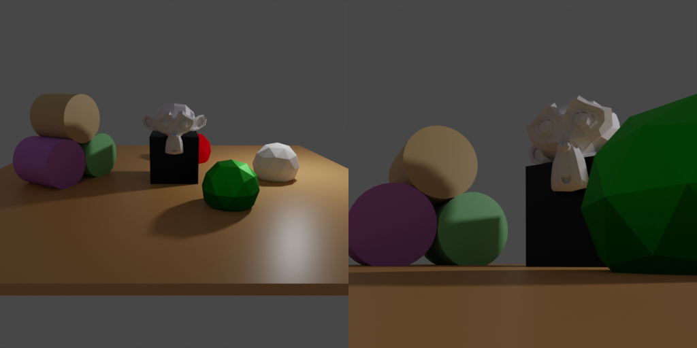

# Light sampling



In this example we are demonstrating the sampling features in relation to light objects.

## Usage

Execute in the BlenderProc main directory:

```
python run.py examples/light_sampling/config.yaml examples/light_sampling/camera_positions examples/light_sampling/scene.obj examples/light_sampling/output
```

* `examples/light_sampling/config.yaml`: path to the configuration file with pipeline configuration.
* `examples/light_sampling/camera_positions`: text file with parameters of camera positions.
* `examples/light_sampling/scene.obj`: path to the object file with the basic scene.
* `examples/light_sampling/output`: path to the output directory.

## Visualization

Visualize the generated data:

```
python scripts/visHdf5Files.py examples/light_sampling/output/0.hdf5
```

## Steps

* Loads `scene.obj`: `loader.ObjectLoader` module.
* Samples light position: `light.LightSampler` module.
* Loads camera positions from `camera_positions`: `camera.CameraLoader` module.
* Writes state of all objects to a file: `writer.ObjectStateWriter` module.
* Writes state of a light to a file: `writer.LightStateWriter` module.
* Writes state of camera poses tp a file: `writer.CameraStateWriter` module.
* Renders rgb: `renderer.RgbRenderer` module.
* Writes the output to .hdf5 containers: `writer.Hdf5Writer` module.

## Config file

### Light sampling

```yaml
{
  "module": "lighting.LightSampler",
  "config": {
    "lights": [
      {
        "location": {
          "provider": "sampler.Shell",
          "center": [1, 2, 3],
          "radius_min": 4,
          "radius_max": 7,
          "elevation_min": 15,
          "elevation_max": 70
          },
          "type": "POINT",
          "energy": 500
      }
    ]
  }
}
```

The focus of this example is `light.LightSampler` module which allows one to sample values for various light attributes. 

* Sample location in a spherical shell.

Note that for this we are using [sampler.Shell](../../src/provider/sampler) Provider which is not a part of a module, but a useful tool for introducing some "controlled randomness" into the process.
To call a sampler for some attribute of a camera, specify a `name` of a desired sampler and define some input arguments for it, e.g. `center`, `radius_min`, `radius_max`, etc.
Sampler returns a value based on these input parameters specified in the config file, check the documentation for the samplers for more information on the input arguments, output formats, etc.
